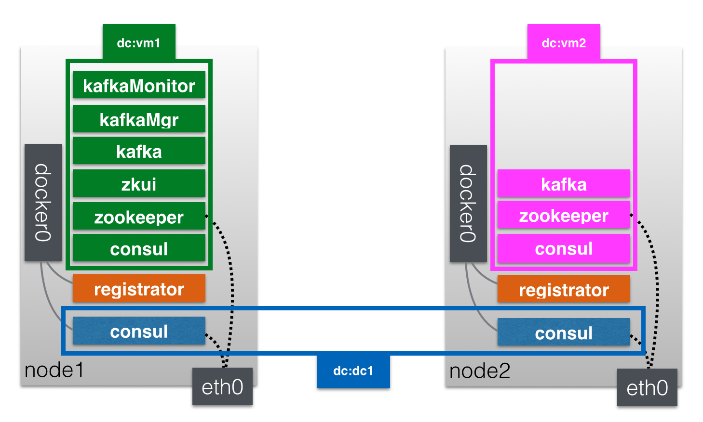

# Distributed Zookeeper

The goal of this setup is to provide a docker-host neutral way of setting up QNIBTerminal on multiple machines.



- node1: 192.168.99.100
- node2: 192.168.99.101

## Base Consul

The consul setup is explained in the `distributed-consul` part of this repo.

It has to start slowly so please do this first:
```
node1 $ compose -f node1.yml up -d consul
node2 $ compose -f node2.yml up -d consul
```

After a moment the rest can get started...

```
node1 $ compose -f node1.yml up -d --no-recreate
node2 $ compose -f node2.yml up -d --no-recreate
```


## Zookeeper

THe stack shown in `distributed-zookeeper` is reused here.

## Kafka

### compose

Kafka is added to the `base.yml`.

```
kafka:
    dns: 127.0.0.1
    dns_search:
    - node.consul
    - service.consul
    image: qnib/kafka
    ports:
    - 9092:9092
    environment:
    - FORWARD_TO_KAFKA=true
    - SERVICE_9092_NAME=kafka
    - ZK_DC=dc1
    privileged: true
```
And to the individual nodes:

```
kafka:
    extends:
      file: base.yml
      service: kafka
    links:
     - zookeeper:zookeeper
     - vmConsul:consul
    environment:
     - DC_NAME=vm1
     - BROKER_ID=1
```
