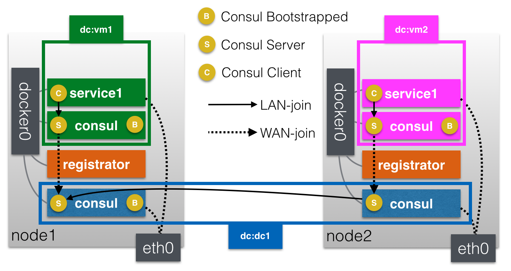
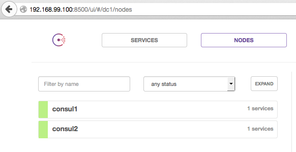
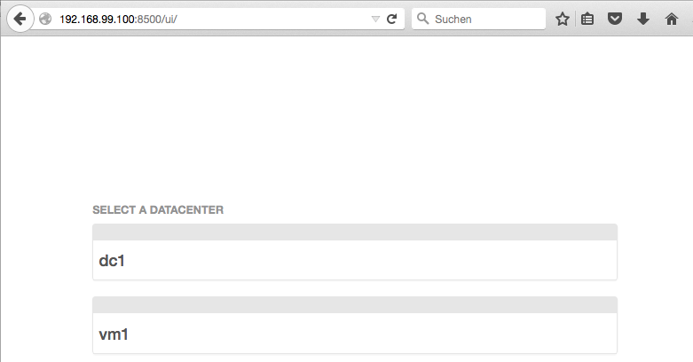
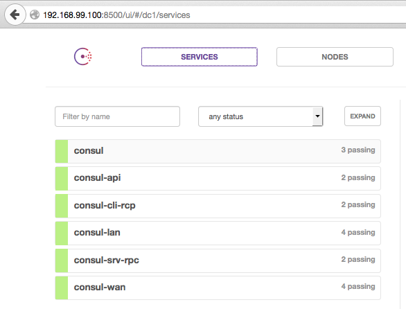

# Distributed Consul

The goal of this setup is to provide a docker-host neutral way of setting up QNIBTerminal on multiple machines.



- node1: 192.168.99.100
- node2: 192.168.99.101

## Base Consul

The blue consul containers expose all consul-ports with the host. The `SERVICE_` environment is registrator notation, just to explain what's what.
The last two variables let consul start as a server and use the DC `dc1`.

```
$ cat base.yml
consul:
   image: qnib/consul
   ports:
    - "8500:8500"
    - "8400:8400"
    - "8302:8302/tcp"
    - "8302:8302/udp"
    - "8301:8301/tcp"
    - "8301:8301/udp"
    - "8300:8300"
   environment:
    - SERVICE_8500_NAME=consul-api
    - SERVICE_8400_NAME=consul-cli-rcp
    - SERVICE_8302_NAME=consul-wan
    - SERVICE_8301_NAME=consul-lan
    - SERVICE_8300_NAME=consul-srv-rpc
    - BOOTSTRAP_CONSUL=false
    - RUN_SERVER=true
    - DC_NAME=dc1
```
The individual  config provides hostnames, let the first node bootstrap consul and link the second to the first.

```
$ cat node1.yml
consul:
    extends:
        file: base.yml
        service: consul
    hostname: consul1
    environment:
    - ADDV_ADDR=192.168.99.100
    - BOOTSTRAP_CONSUL=true
$ cat node2.yml
consul:
    extends:
        file: base.yml
        service: consul
    hostname: consul2
    environment:
    - ADDV_ADDR=192.168.99.101
    - LINKED_SERVER=192.168.99.100
```

By starting both, they appear in both consul http api.

```
node1$ compose -f node1.yml up -d consul
Creating distributedconsul_consul_1...
# switch to the second node
node2$ compose -f node2.yml up -d consul
Creating distributedconsul_consul_1...
```
Consul sees the members as expected


```
node1$ dexec distributedconsul_consul_1
[root@consul1 /]# consul members
Node     Address              Status  Type    Build  Protocol  DC
consul1  192.168.99.100:8301  alive   server  0.5.2  2         dc1
consul2  192.168.99.101:8301  alive   server  0.5.2  2         dc1
[root@consul1 /]#
# switch to the second node
node2$ dexec distributedconsul_consul_1
[root@consul2 /]# consul members
Node     Address              Status  Type    Build  Protocol  DC
consul2  192.168.99.101:8301  alive   server  0.5.2  2         dc1
consul1  192.168.99.100:8301  alive   server  0.5.2  2         dc1
node2$
```

## Internal Consul

OK, now that the base is set up let's start the consul agents serving as internal DC-server.
Config:

```
$ cat base.yml
vmConsul:
   image: qnib/consul
   ports:
    - "18500:8500"
   environment:
    - SERVICE_8500_IGNORE=yes
    - WAN_SERVER=172.17.42.1
    - BOOTSTRAP_CONSUL=true
    - RUN_SERVER=true
$ cat node1.yml
vmConsul:
    extends:
        file: base.yml
        service: vmConsul
    hostname: vmConsul1
    environment:
     - DC_NAME=vm1
```
And fire 'em up...

```
node1$ compose -f node1.yml up -d vmConsul
Creating distributedconsul_vmConsul_1...
# switch to the second node
node2$ compose -f node2.yml up -d vmConsul
Creating distributedconsul_vmConsul_1...
```
Now both base-consul WebUI show the local DC `vm1` & `vm2`.


The wan members are fine:

```
[root@consul1 /]# consul members -wan
Node           Address              Status  Type    Build  Protocol  DC
consul1.dc1    192.168.99.100:8302  alive   server  0.5.2  2         dc1
vmConsul1.vm1  172.17.0.6:8302      alive   server  0.5.2  2         vm1
[root@consul1 /]#
# switch to the second node
[root@consul2 /]# consul members -wan
Node           Address              Status  Type    Build  Protocol  DC
consul2.dc1    192.168.99.101:8302  alive   server  0.5.2  2         dc1
vmConsul2.vm2  172.17.0.11:8302     alive   server  0.5.2  2         vm2
[root@consul2 /]#
```

## Registrator
To automatically register services from the internal dc to the global I use `registrator `.

```
$ cat base.ml 
registrator:
   image: gliderlabs/registrator:latest
   hostname: registrator
   volumes:
    - /var/run/docker.sock:/tmp/docker.sock
$ cat node1.yml
registrator:
    extends:
        file: base.yml
        service: registrator
    command: -ip 192.168.99.100 consul://172.17.42.1:8500 # .101 for node2.yml
 ```
 The registrator will add the services to the global consul agent, as specified earlier.
 
 ```
 node1$ compose -f node1.yml up -d registrator
Recreating distributedconsul_registrator_1...
node1$ docker logs distributedconsul_registrator_1
2015/09/01 09:35:26 Starting registrator v6 ...
2015/09/01 09:35:26 Forcing host IP to 192.168.99.100
2015/09/01 09:35:26 consul: current leader  192.168.99.100:8300
2015/09/01 09:35:26 Using consul adapter: consul://172.17.42.1:8500
2015/09/01 09:35:26 Listening for Docker events ...
2015/09/01 09:35:26 Syncing services on 3 containers
2015/09/01 09:35:26 ignored: 2ba2d24fb98e no published ports
2015/09/01 09:35:26 ignored: 7d6df6d056a9 no published ports
2015/09/01 09:35:26 added: a757b6b52a93 registrator:distributedconsul_consul_1:8300
2015/09/01 09:35:26 added: a757b6b52a93 registrator:distributedconsul_consul_1:8301
2015/09/01 09:35:26 added: a757b6b52a93 registrator:distributedconsul_consul_1:8301:udp
2015/09/01 09:35:26 added: a757b6b52a93 registrator:distributedconsul_consul_1:8302
2015/09/01 09:35:26 added: a757b6b52a93 registrator:distributedconsul_consul_1:8302:udp
2015/09/01 09:35:26 added: a757b6b52a93 registrator:distributedconsul_consul_1:8400
2015/09/01 09:35:26 added: a757b6b52a93 registrator:distributedconsul_consul_1:8500
```


### consul monitor
So far, all consul logs seem nicely shaped:

```
[root@consul1 /]# consul monitor
2015/09/01 11:51:57 [INFO] serf: EventMemberJoin: consul1 192.168.99.100
2015/09/01 11:51:57 [INFO] serf: EventMemberJoin: consul1.dc1 192.168.99.100
2015/09/01 11:51:57 [INFO] raft: Node at 192.168.99.100:8300 [Follower] entering Follower state
2015/09/01 11:51:57 [INFO] consul: adding server consul1 (Addr: 192.168.99.100:8300) (DC: dc1)
2015/09/01 11:51:57 [INFO] consul: adding server consul1.dc1 (Addr: 192.168.99.100:8300) (DC: dc1)
2015/09/01 11:51:57 [ERR] agent: failed to sync remote state: No cluster leader
2015/09/01 11:51:58 [WARN] raft: Heartbeat timeout reached, starting election
2015/09/01 11:51:58 [INFO] raft: Node at 192.168.99.100:8300 [Candidate] entering Candidate state
2015/09/01 11:51:58 [INFO] raft: Election won. Tally: 1
2015/09/01 11:51:58 [INFO] raft: Node at 192.168.99.100:8300 [Leader] entering Leader state
2015/09/01 11:51:58 [INFO] consul: cluster leadership acquired
2015/09/01 11:51:58 [INFO] consul: New leader elected: consul1
2015/09/01 11:51:58 [INFO] raft: Disabling EnableSingleNode (bootstrap)
2015/09/01 11:51:58 [INFO] consul: member 'consul1' joined, marking health alive
2015/09/01 11:51:59 [INFO] agent: Synced service 'consul'
2015/09/01 11:51:59 [INFO] agent: Synced check 'syslog'
2015/09/01 11:52:01 [INFO] serf: EventMemberJoin: consul2 192.168.99.101
2015/09/01 11:52:01 [INFO] consul: adding server consul2 (Addr: 192.168.99.101:8300) (DC: dc1)
2015/09/01 11:52:01 [INFO] raft: Added peer 192.168.99.101:8300, starting replication
2015/09/01 11:52:01 [WARN] raft: AppendEntries to 192.168.99.101:8300 rejected, sending older logs (next: 1)
2015/09/01 11:52:01 [INFO] raft: pipelining replication to peer 192.168.99.101:8300
2015/09/01 11:52:01 [INFO] consul: member 'consul2' joined, marking health alive
2015/09/01 11:52:03 [INFO] agent: Synced check 'syslog'
2015/09/01 11:52:07 [INFO] serf: EventMemberJoin: vmConsul1.vm1 172.17.0.21
2015/09/01 11:52:07 [INFO] consul: adding server vmConsul1.vm1 (Addr: 172.17.0.21:8300) (DC: vm1)
2015/09/01 11:52:15 [INFO] agent: Synced service 'registrator:distributedconsul_consul_1:8301'
2015/09/01 11:52:15 [INFO] agent: Synced service 'registrator:distributedconsul_consul_1:8301:udp'
2015/09/01 11:52:15 [INFO] agent: Synced service 'registrator:distributedconsul_consul_1:8302'
2015/09/01 11:52:15 [INFO] agent: Synced service 'registrator:distributedconsul_consul_1:8302:udp'
2015/09/01 11:52:15 [INFO] agent: Synced service 'registrator:distributedconsul_consul_1:8400'
2015/09/01 11:52:15 [INFO] agent: Synced service 'registrator:distributedconsul_consul_1:8500'
2015/09/01 11:52:15 [INFO] agent: Synced service 'registrator:distributedconsul_consul_1:8300'
2015/09/01 11:52:31 [INFO] agent.rpc: Accepted client: 127.0.0.1:59921
```
Second base consul...

```
[root@consul2 /]# consul monitor
2015/09/01 11:52:01 [INFO] serf: EventMemberJoin: consul2 192.168.99.101
2015/09/01 11:52:01 [INFO] serf: EventMemberJoin: consul2.dc1 192.168.99.101
2015/09/01 11:52:01 [INFO] raft: Node at 192.168.99.101:8300 [Follower] entering Follower state
2015/09/01 11:52:01 [INFO] agent: (LAN) joining: [192.168.99.100]
2015/09/01 11:52:01 [INFO] consul: adding server consul2 (Addr: 192.168.99.101:8300) (DC: dc1)
2015/09/01 11:52:01 [INFO] consul: adding server consul2.dc1 (Addr: 192.168.99.101:8300) (DC: dc1)
2015/09/01 11:52:01 [INFO] serf: EventMemberJoin: consul1 192.168.99.100
2015/09/01 11:52:01 [INFO] agent: (LAN) joined: 1 Err: <nil>
2015/09/01 11:52:01 [ERR] agent: failed to sync remote state: No cluster leader
2015/09/01 11:52:01 [INFO] consul: adding server consul1 (Addr: 192.168.99.100:8300) (DC: dc1)
2015/09/01 11:52:01 [WARN] raft: Failed to get previous log: 5 log not found (last: 0)
2015/09/01 11:52:11 [INFO] serf: EventMemberJoin: vmConsul2.vm2 172.17.0.18
2015/09/01 11:52:11 [INFO] consul: adding server vmConsul2.vm2 (Addr: 172.17.0.18:8300) (DC: vm2)
2015/09/01 11:52:20 [INFO] agent: Synced service 'consul'
2015/09/01 11:52:20 [INFO] agent: Synced service 'registrator:distributedconsul_consul_1:8500'
2015/09/01 11:52:20 [INFO] agent: Synced check 'syslog'
2015/09/01 11:52:20 [INFO] agent: Synced service 'registrator:distributedconsul_consul_1:8300'
2015/09/01 11:52:20 [INFO] agent: Synced service 'registrator:distributedconsul_consul_1:8301'
2015/09/01 11:52:20 [INFO] agent: Synced service 'registrator:distributedconsul_consul_1:8301:udp'
2015/09/01 11:52:20 [INFO] agent: Synced service 'registrator:distributedconsul_consul_1:8302'
2015/09/01 11:52:20 [INFO] agent: Synced service 'registrator:distributedconsul_consul_1:8302:udp'
2015/09/01 11:52:20 [INFO] agent: Synced service 'registrator:distributedconsul_consul_1:8400'
2015/09/01 11:52:37 [INFO] agent.rpc: Accepted client: 127.0.0.1:33741
```

## Add internal service
OK, after the setup is done, lets add a web server to the vm1 DC and see how this works out.

```
$ cat base.ml
es:
   image: qnib/elasticsearch
   dns: 127.0.0.1
   ports:
    - "9200:9200/tcp"
    - "9200:9200/udp"
    - "9300:9300/tcp"
    - "9300:9300/udp"
   environment:
    - SERVICE_9200_NAME=elasticsearch
    - SERVICE_9300_NAME=es-transport
    - RUN_SERVER=false
    - BOOTSTRAP_CONSUL=false
$ cat node1.yml
es:
    extends:
        file: base.yml
        service: es
    hostname: es1
    environment:
     - DC_NAME=vm1
    links:
     - vmConsul:consul
```

# Problem
So far everything is setup and the logs are clean as... something that is clean...

The trouble comes if I want to use the local DNS on all machines.

```
[root@consul2 /]# consul monitor
2015/09/01 12:19:08 [INFO] serf: EventMemberJoin: consul2 192.168.99.101
2015/09/01 12:19:08 [INFO] serf: EventMemberJoin: consul2.dc1 192.168.99.101
2015/09/01 12:19:08 [INFO] raft: Node at 192.168.99.101:8300 [Follower] entering Follower state
2015/09/01 12:19:08 [INFO] agent: (LAN) joining: [192.168.99.100]
2015/09/01 12:19:08 [INFO] consul: adding server consul2 (Addr: 192.168.99.101:8300) (DC: dc1)
2015/09/01 12:19:08 [INFO] consul: adding server consul2.dc1 (Addr: 192.168.99.101:8300) (DC: dc1)
2015/09/01 12:19:08 [INFO] agent: (LAN) joined: 1 Err: <nil>
2015/09/01 12:19:08 [ERR] agent: failed to sync remote state: No cluster leader
2015/09/01 12:19:09 [WARN] raft: EnableSingleNode disabled, and no known peers. Aborting election.
2015/09/01 12:19:13 [INFO] serf: EventMemberJoin: consul1.dc1 192.168.99.100
2015/09/01 12:19:13 [INFO] serf: EventMemberJoin: vmConsul1.vm1 172.17.0.37
2015/09/01 12:19:13 [INFO] consul: adding server consul1.dc1 (Addr: 192.168.99.100:8300) (DC: dc1)
2015/09/01 12:19:13 [INFO] consul: adding server vmConsul1.vm1 (Addr: 172.17.0.37:8300) (DC: vm1)
2015/09/01 12:19:15 [INFO] serf: EventMemberJoin: vmConsul2.vm2 172.17.0.46
2015/09/01 12:19:15 [INFO] consul: adding server vmConsul2.vm2 (Addr: 172.17.0.46:8300) (DC: vm2)
2015/09/01 12:19:23 [INFO] memberlist: Suspect vmConsul1.vm1 has failed, no acks received
2015/09/01 12:19:23 [WARN] memberlist: Refuting a suspect message (from: vmConsul1.vm1)
```
The agents somehow start seeing each other and they are getting confused.

## Workaround 09/2015

When I only use the DNS server within the internal clusters, it might be alright. 

- Only the internal service nodes using the local DNS server
- I missed the order in registrators config, so `-ip` was ignored, what gave me the internal IP
By doing so I can query `elasticsearch.service.dc1.consul` and I get the external IP addresses of the service across the cluster.

```
[root@es2 /]# dig +short SRV elasticsearch.service.dc1.consul
1 1 9200 consul2.node.dc1.consul.
1 1 9200 consul1.node.dc1.consul.
[root@es2 /]# dig +short A elasticsearch.service.dc1.consul
192.168.99.100
192.168.99.101
```

If I want to stay within my own DC, I get the interal IPs.
```
[root@es2 /]# dig +short A elasticsearch.service.consul
172.17.0.16
```